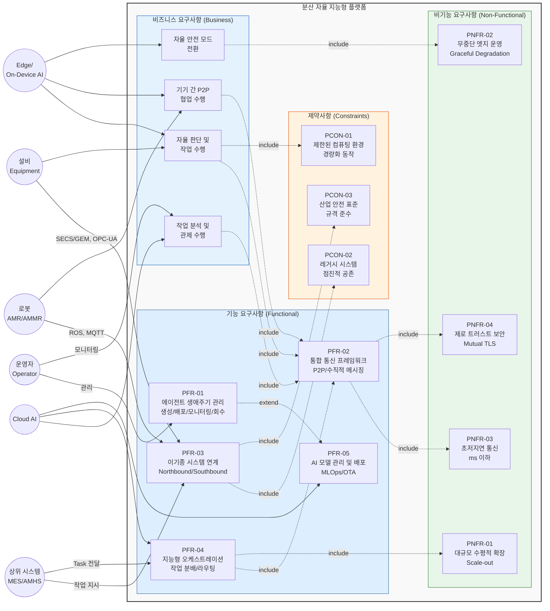

```mermaid
graph LR
    %% ===== Actors =====
    UpperSystem(("상위 시스템<br/>MES/AMHS"))
    Operator(("운영자<br/>Operator"))
    CloudAI(("Cloud AI"))
    EdgeAI(("Edge/<br/>On-Device AI"))
    Equipment(("설비<br/>Equipment"))
    Robot(("로봇<br/>AMR/AMMR"))

    %% ===== 기능 요구사항 =====
    subgraph Platform["분산 자율 지능형 플랫폼"]
        subgraph FR["기능 요구사항 (Functional)"]
            UC01["PFR-01<br/>에이전트 생애주기 관리<br/>생성/배포/모니터링/회수"]
            UC02["PFR-02<br/>통합 통신 프레임워크<br/>P2P/수직적 메시징"]
            UC03["PFR-03<br/>이기종 시스템 연계<br/>Northbound/Southbound"]
            UC04["PFR-04<br/>지능형 오케스트레이션<br/>작업 분배/라우팅"]
            UC05["PFR-05<br/>AI 모델 관리 및 배포<br/>MLOps/OTA"]
        end

        subgraph BZ["비즈니스 요구사항 (Business)"]
            UC06["작업 분석 및<br/>관제 수행"]
            UC07["자율 판단 및<br/>작업 수행"]
            UC08["기기 간 P2P<br/>협업 수행"]
            UC09["자율 안전 모드<br/>전환"]
        end

        subgraph NFR["비기능 요구사항 (Non-Functional)"]
            UC10["PNFR-01<br/>대규모 수평적 확장<br/>Scale-out"]
            UC11["PNFR-02<br/>무중단 엣지 운영<br/>Graceful Degradation"]
            UC12["PNFR-03<br/>초저지연 통신<br/>ms 이하"]
            UC13["PNFR-04<br/>제로 트러스트 보안<br/>Mutual TLS"]
        end

        subgraph CON["제약사항 (Constraints)"]
            UC14["PCON-01<br/>제한된 컴퓨팅 환경<br/>경량화 동작"]
            UC15["PCON-02<br/>레거시 시스템<br/>점진적 공존"]
            UC16["PCON-03<br/>산업 안전 표준<br/>규격 준수"]
        end
    end

    %% ===== Actor → Use Case 연결 =====
    UpperSystem -->|작업 지시| UC03
    UpperSystem -->|Task 전달| UC04
    Operator -->|관리| UC01
    Operator -->|모니터링| UC06
    CloudAI --> UC06
    CloudAI --> UC04
    CloudAI --> UC05
    EdgeAI --> UC07
    EdgeAI --> UC08
    EdgeAI --> UC09
    Equipment -->|"SECS/GEM, OPC-UA"| UC03
    Equipment --> UC07
    Robot -->|"ROS, MQTT"| UC03
    Robot --> UC08

    %% ===== Include 관계 =====
    UC04 -.->|include| UC02
    UC08 -.->|include| UC02
    UC06 -.->|include| UC02
    UC07 -.->|include| UC02
    UC09 -.->|include| UC11
    UC02 -.->|include| UC12
    UC02 -.->|include| UC13
    UC04 -.->|include| UC10
    UC01 -.->|extend| UC05
    UC03 -.->|include| UC15
    UC07 -.->|include| UC14
    UC03 -.->|include| UC16

    %% ===== 스타일 =====
    style Platform fill:#f9f9f9,stroke:#333,stroke-width:2px
    style FR fill:#DDEEFF,stroke:#336699
    style BZ fill:#E3F2FD,stroke:#1565C0
    style NFR fill:#E8F5E9,stroke:#2E7D32
    style CON fill:#FFF3E0,stroke:#E65100
```
